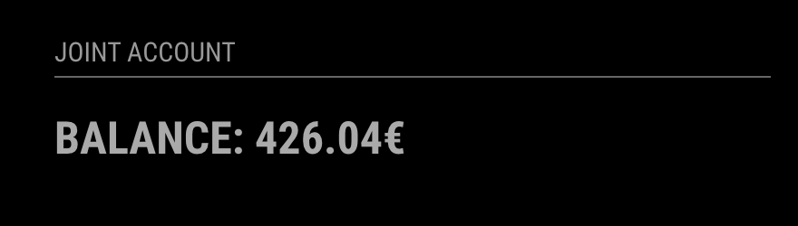

# MMM-bunq

This is a module for the [MagicMirror²](https://github.com/MichMich/MagicMirror/).

This module will show your [bunq](https://www.bunq.com/) account balance on the smart mirror. All you need is a bunq account. The use of the API is free 🙌

[](https://www.repostatus.org/#inactive)



## Installation

This module is pretty simple to set up. You simply need to clone the module into your modules folder (like other modules).

```
$ cd MagicMirror/modules
$ git clone https://github.com/choffmann/MMM-bunq.git
```

After you clone the repositories, you have to install the `node modules`

```
$ cd ./MMM-bunq
$ npm install
```

## Get your API Key

To use this module, you need a API key from bunq. You can create an API key either in bunq`s [developer portal](https://developer.bunq.com/) or in the bunq app (Profile → Security & Settings → Developers → API keys).

## Using the module

To use this module, add the following configuration block to the modules array in the `config/config.js` file:

```js
var config = {
  modules: [
    {
      module: "MMM-bunq",
      position: "top_left",
      header: "Joint Account",
      config: {
        iban: "YOUR_IBAN",
        apiKey: "YOUR_API_KEY"
      }
    }
  ]
};
```

## Configuration options

| Option           | Description                                                                                                                |
| ---------------- | -------------------------------------------------------------------------------------------------------------------------- |
| `apiKey`         | **_Required_** Your bunq API Key goes here.                                                                                |
| `iban`           | **_Required_** IBAN of your bunq monetary account, which will appear on the screen.                                        |
| `title`          | **_Optional_** Title in front of the balance. The title will be uppercase <br><br>**Type:** `String` <br>Default `Balance` |
| `unit`           | **_Optional_** Unit of the balance <br><br>**Type:** `String` <br>Default `€` (Euro)                                       |
| `updateInterval` | **_Optional_** Refresh rate <br><br>**Type:** `int`(milliseconds) <br>Default 60000 milliseconds (1 minute)                |
